<h1 align="center">
  <br>
  Stereo Calib
  <br>
</h1>

<h4 align="center">Calibration for Stereo Cameras</h4>

<p align="center">
  <a href="#description">Description</a> •
  <a href="#getting-started">Getting Started</a> •
  <a href="#calibration">Calibration</a> •
  <a href="#detailed-report">Detailed Report</a> •
  <a href="#results">Results</a> •
  <a href="#references">References</a> 
</p>

<div align="center">

|Rectified Stereo-Pair |            Disparity Map            | Depth Map 
:--------------------:|:-----------------------------------:|:----------:
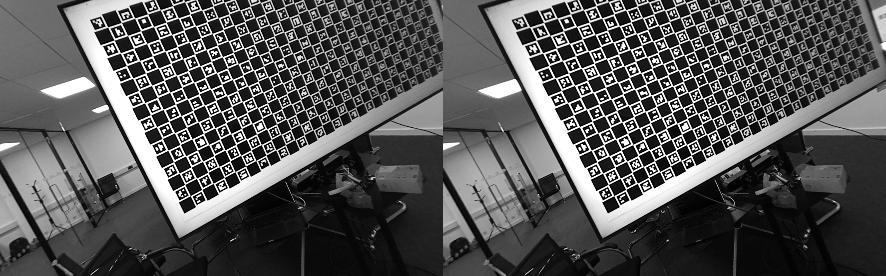 | 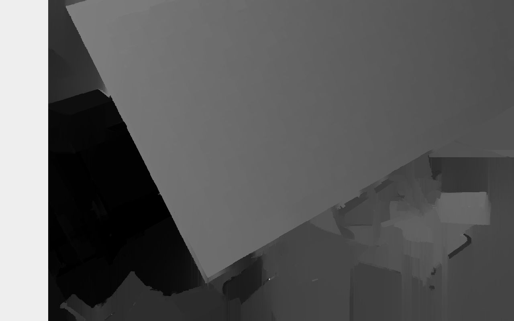 | 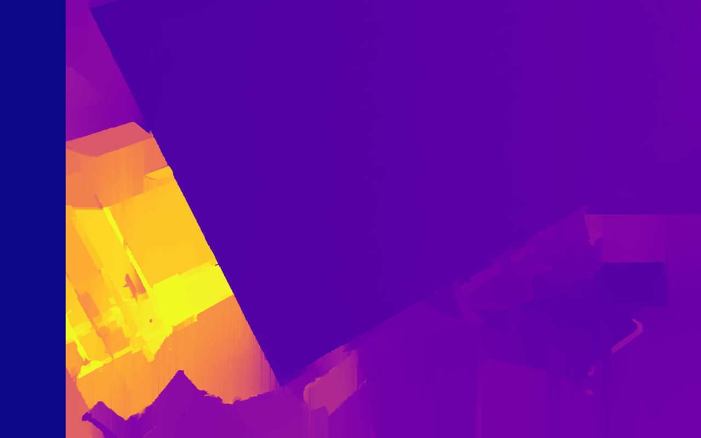

</div>

## Description

Stereo Calib is a project dedicated to performing stereo camera calibration using Charuco boards, followed by
rectification, disparity map generation, and depth map estimation.

## Getting Started

### Setup

* Install [poetry](https://python-poetry.org/docs/#installation)
* Navigate to the project directory: `cd stereo-calib`
* Install necessary dependencies:

```commandline
poetry config virtualenvs.in-project true                  
poetry install 
```

## Calibration

### Perform Calibration : Save Rectified Images, Disparity and Depth Maps

To conduct stereo camera calibration, execute the following command:

```commandline
poetry run python -m examples.perform_calibration --data-path "./dataset" 
```

This script generates rectified stereo images along with disparity and depth maps, saving the calibration results to a
[results](./results) folder.

### Perform Calibration: Estimate Distance Between Camera And Image Centre

To execute stereo camera calibration and estimate the distance between the camera and the image center, run the
following command:

```commandline
poetry run python -m examples.perform_calibration_and_estimate_distance --data-path "./dataset"
```

This scripts saves calibration results to [results](./results) folder outputs the computed distances in millimeters to a
JSON
file.

### Perform Calibration: Overall Calibration Analysis

To execute stereo camera calibration with overall calibration analysis, run the following
command:

```commandline
poetry run python -m examples.perform_calibration_with_overall_analysis --data-path "./dataset"             
```

This script conducts post-calibration analysis, including calculating and plotting reprojection errors and root mean
square (RMS) errors for both left and right camera views. Finally, it saves the calibration results
to [results](./results) folder and displays the
analysis plots.

### Perform Calibration: Single Image Analysis

To execute stereo camera calibration with single image analysis, run the following command:

```commandline
poetry run python -m examples.perform_calibration_with_single_image_analysis --data-path "./dataset"
```

This script randomly selects a stereo image pair, analyses it by plotting detected markers, calculating and plotting
reprojection errors, and visualising rectified images, disparity maps, and depth maps. Finally, it saves the calibration
results to [results](./results) folder and displays the analysis plots.

## Detailed Report

For a comprehensive overview of the stereo calibration process, stereo calibration results, and post-calibration
analysis, refer to the detailed [report](REPORT.md).

## Results

All the [rectified calibration images](./results/stereo_rectified), along with the
corresponding [disparity maps](./results/disparity_map), [depth maps](./results/depth_map_img),
and [raw depth maps](./results/raw_depth_map) for all stereo pairs in the calibration dataset, can be found in
the [results](./results) folder.

Additionally, the calibration results, containing camera matrices, distortion coefficients, rectification transforms, 
projection matrices, and disparity-to-depth mapping matrices, are stored in a JSON file [here](./results/calibration_results.json). 
Moreover, the distance between the camera and the center of the image for all calibration images is also saved in a separate JSON file [here](./results/centre_image_distances_in_mm.json).

Below are some example rectified stereo-pair images, disparity maps, and depth maps:

|              Rectified Stereo-Pair     |            Disparity Map            | Depth Map |
:--------------------------------------:|:-----------------------------------:|:----------:
 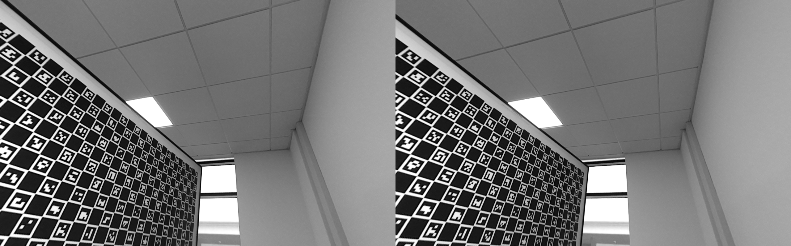 | 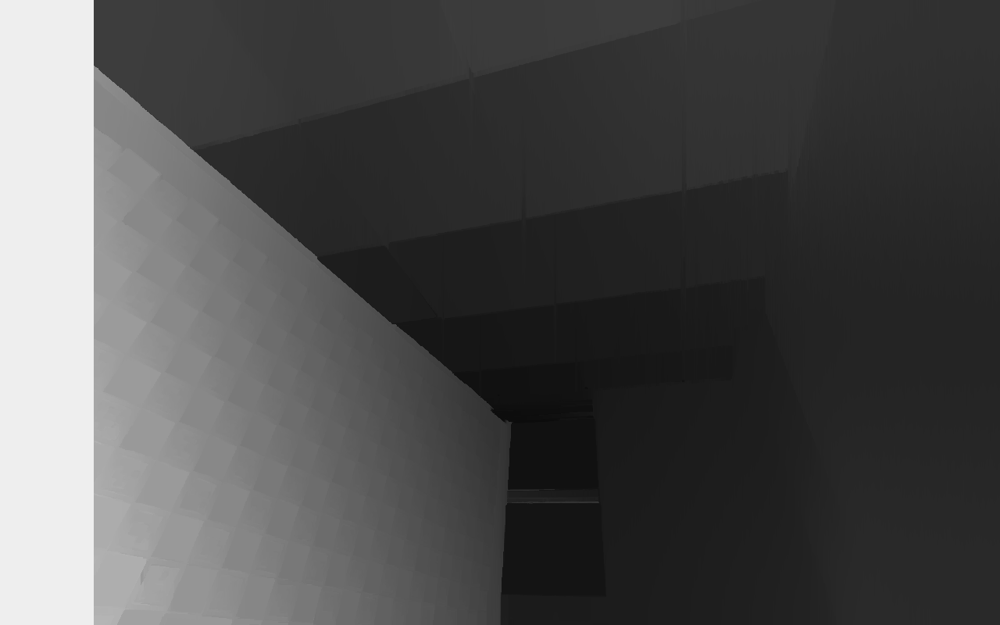 | 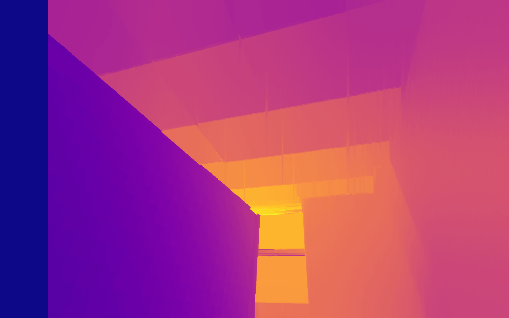
  | 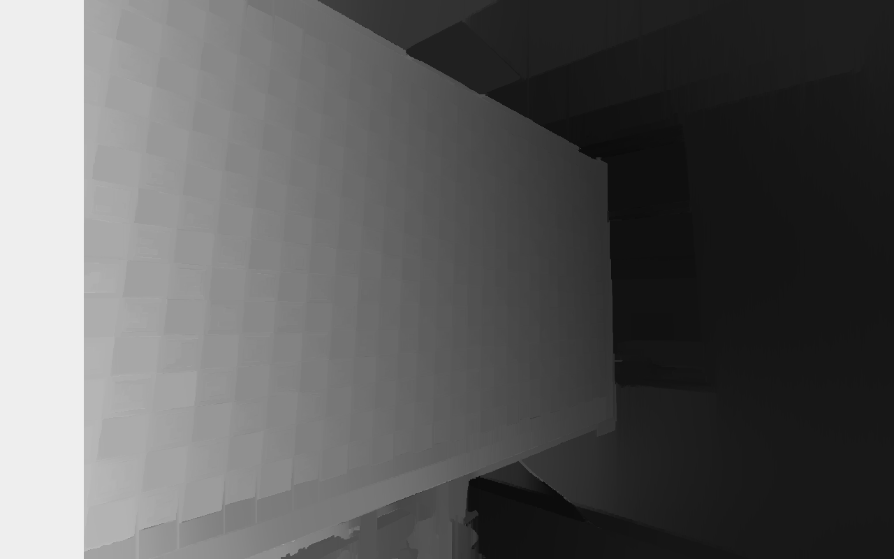 | 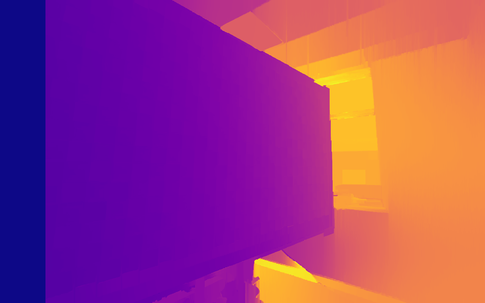
 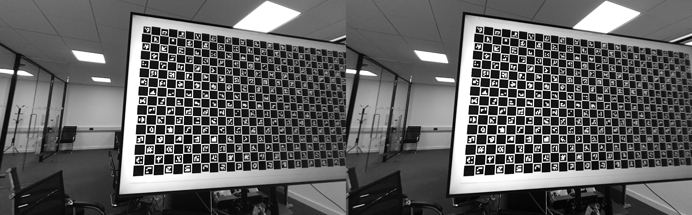 | 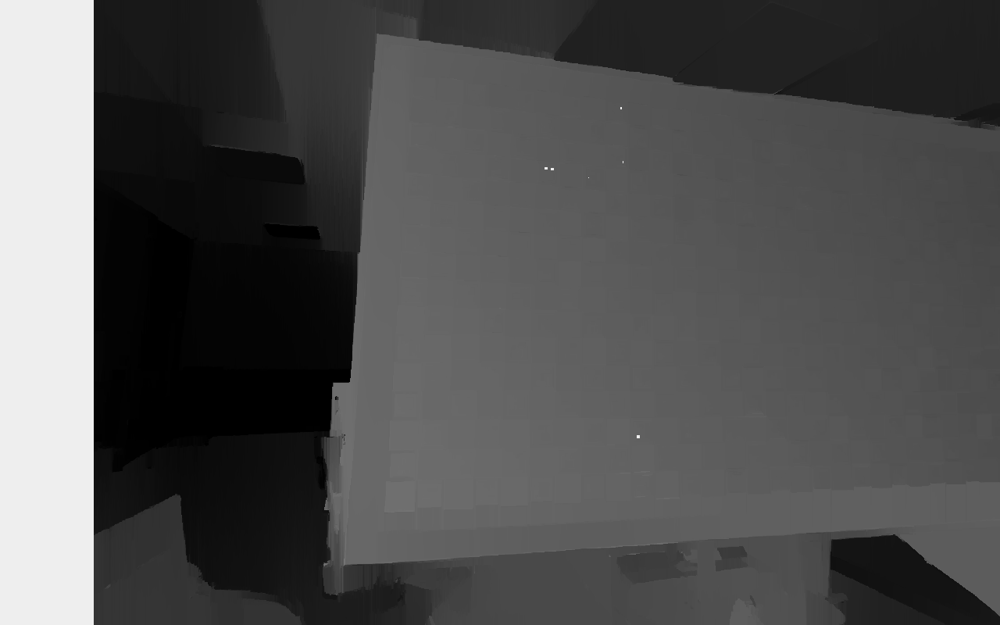 | 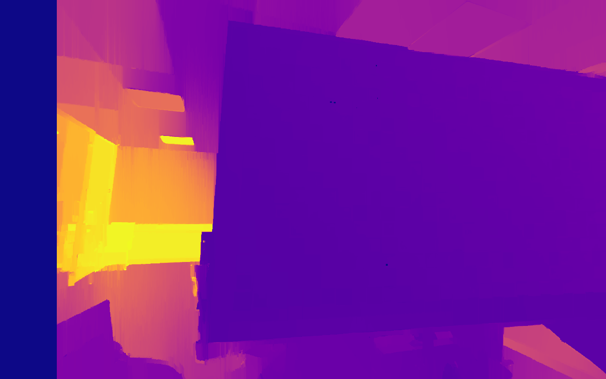

## References

* [OpenCV](https://docs.opencv.org/4.9.0/)
* [Multi-View Geometry in Computer Vision](https://www.robots.ox.ac.uk/~vgg/hzbook/)
* [Zhang's Calibration Method](https://www.microsoft.com/en-us/research/wp-content/uploads/2016/02/tr98-71.pdf)

